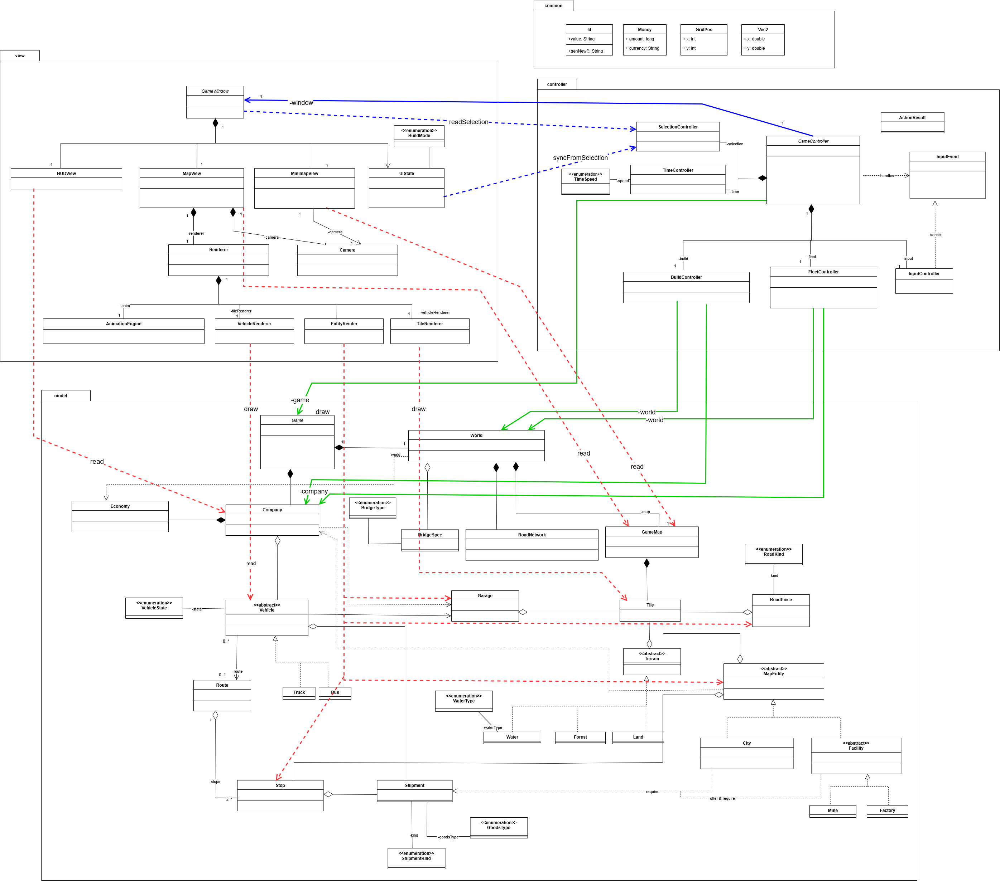
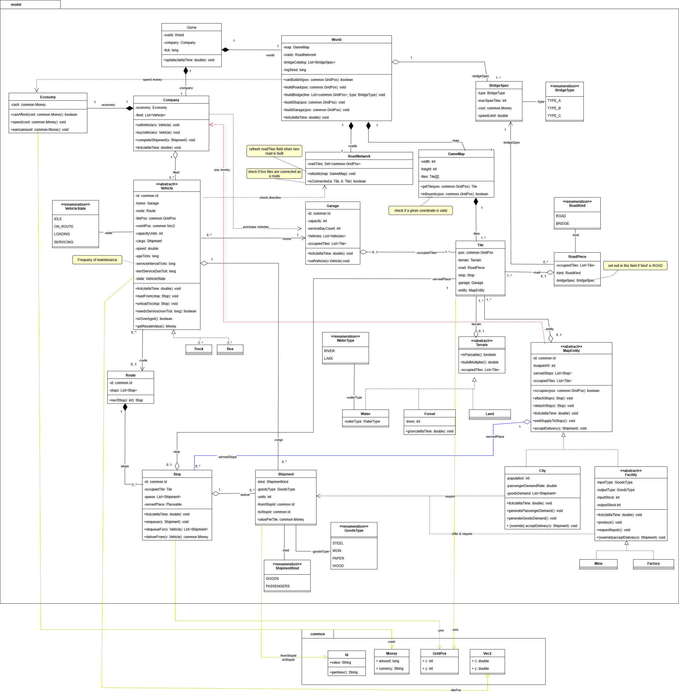
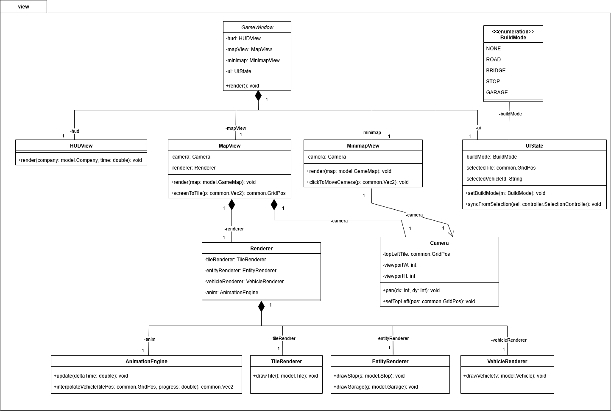
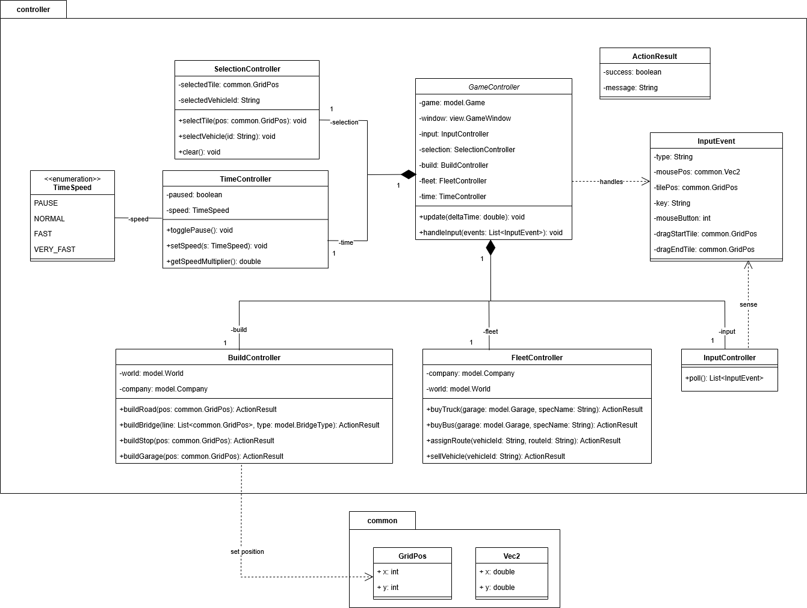
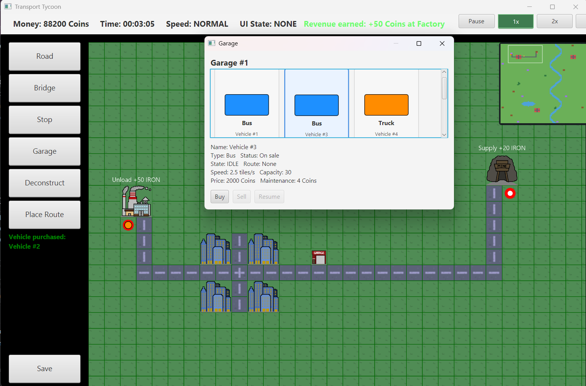
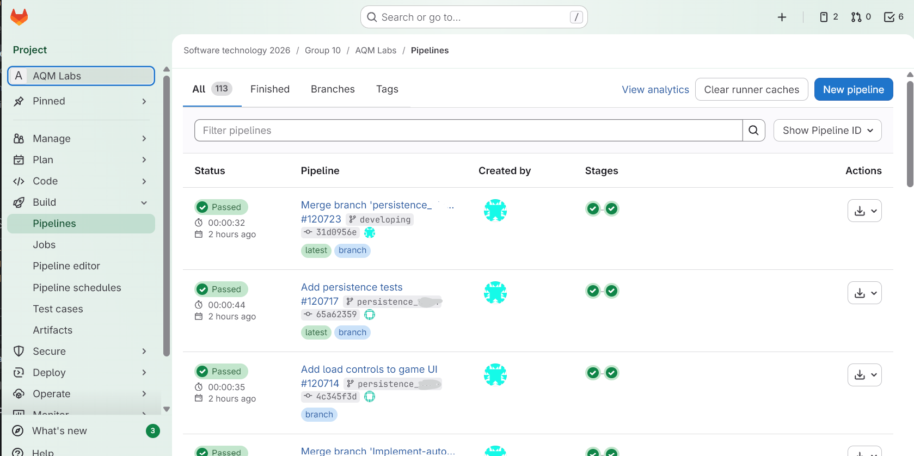
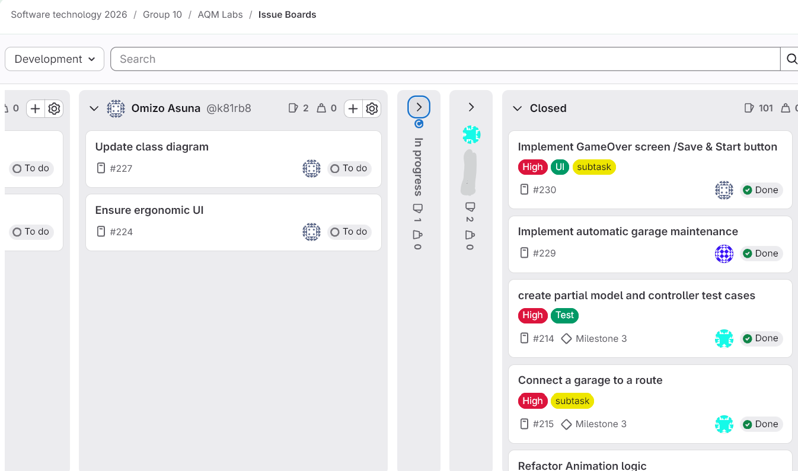
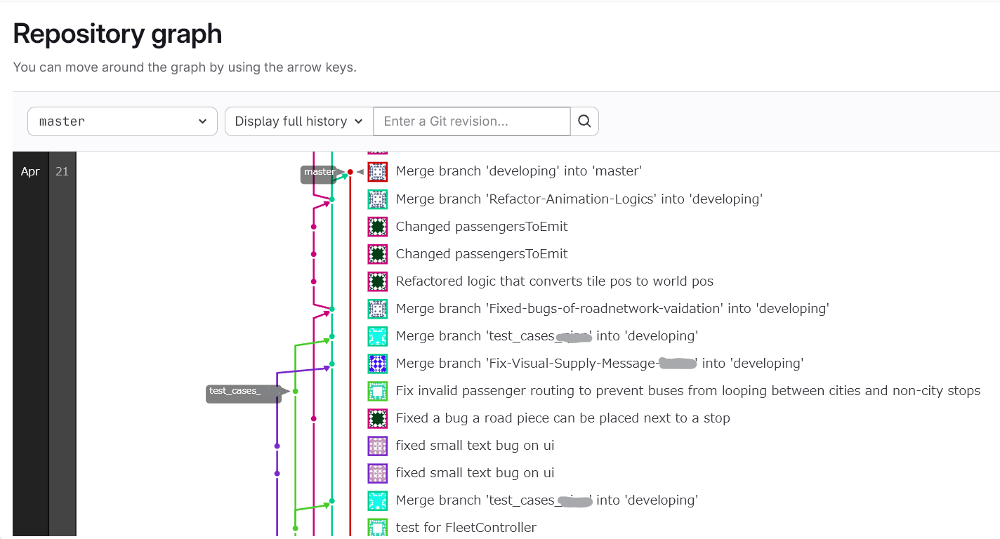

# 🚚🚗Transport Tycoon JavaFX Team Project 🛣🌳💶

A team-based Java game project inspired by Transport Tycoon, developed as part of a university software development course.

The project is currently under development. This repository focuses on showing the current application design, UI progress, team development workflow, and CI/CD setup.

## Overview

This project is a transport simulation game where players build and manage transportation infrastructure. The application is designed based on the MVC architecture to separate game logic, user interaction, and visual rendering.

## My Contributions

- Designed UML diagrams to clarify the system architecture
- Contributed to the JavaFX-based UI implementation
- Implemented vehicle movement logic
- Worked in a team development environment using GitLab

## Technologies

- Java
- JavaFX
- Maven
- JUnit
- GitLab
- CI/CD pipelines

## Architecture

The application follows the MVC pattern:

- Model: game world, entities, transport logic, and simulation state
- View: JavaFX UI and map rendering
- Controller: user input handling and coordination between Model and View

## Current Status

This project is still in progress. Core functionalities and system architecture have been implemented, including the UML design and major game logic. The remaining work mainly focuses on testing, deployment, and further UI improvements.

## Screenshots and Design Documents

### 1. UML Class Diagram

These UML diagrams were created to make the relationships between classes and the responsibilities of methods clear at a glance. It follows the MVC structure and was used to support smoother team collaboration.

### 2. Current UI

This screenshot shows the current JavaFX user interface. The UI is still under development, but it demonstrates the basic layout and visual direction of the game.

### 3. CI/CD Pipeline

Used GitLab CI pipelines to support automated testing and collaborative development.

### 4. GitLab Team Development

These screenshots demonstrate the collaborative development workflow using GitLab, including branch management, issue tracking, task organization.
